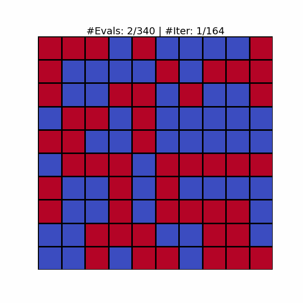
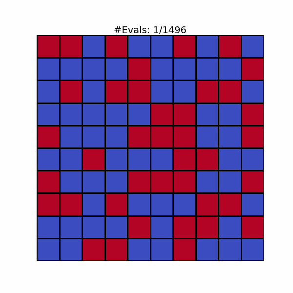

<h1>
    <p align="center">
        Deep Reinforcement Learning for Dynamic Algorithm  Configuration
    </p>
</h1>

This repository contains the implementation for paper: **Deep Reinforcement Learning for Dynamic Algorithm  Configuration: A Case Study on OneMax with (1+($\lambda$, $\lambda$))-GA**

## 🗒️ Table of Contents

- [Introduction](#introduction)
- [Repository Structure](#repository-structure)
- [Installation](#installation)
- [Quickstart](#quickstart)

## 💡 Introduction

We propose applying RL to control the population size of the (1+($\lambda$, $\lambda$))-GA optimizing the OneMax problem. We use the number of evaluations (#Evals) at each step to validate how well the RL-based policy can choose the proper $\lambda$ to maximize the number of 1s in a given binary string.

We provide an example to visualize improvements in a problem of size 100 (using a 10×10 grid to save space), comparing two controllers: an RL-based policy and a random policy. Blue cells denote the 1s bit, while red cells represent the 0s bit. The optimal state occurs when the grid is completely filled with blue cells.

|RL-based Policy|Random Policy|
|--|--|
|||


## 🎯 Repository Structure

Outline the structure of repository.

```plaintext
OneMax-DAC-Ext/
├── assets/                         # Visualization assets
│   ├── ddqn_n100.gif              # RL-based policy visualization
│   └── random_n100.gif            # Random policy visualization
├── dacbench/                       # DACBench framework components
│   ├── benchmarks/                 # Benchmark implementations
│   │   └── theory_benchmark.py    # Theory benchmark module
│   ├── envs/                      # Environment implementations
│   │   ├── theory.py              # Theory environment
│   │   └── policies/              # Policy implementations
│   ├── instance_sets/             # Problem instance sets
│   ├── wrappers/                  # Environment wrappers
│   ├── abstract_*.py              # Abstract base classes
│   ├── runner.py                  # Main runner module
│   └── ...                        # Other framework components
├── docs/                          # Documentation files
├── hydra_plugins/                 # Hyperparameter optimization plugins
│   ├── hyper_analysis/            # Analysis tools
│   ├── hyper_carp_s/             # CARP-S optimizer
│   ├── hyper_dehb/               # DEHB optimizer
│   ├── hyper_hebo/               # HEBO optimizer
│   ├── hyper_neps/               # NePS optimizer
│   ├── hyper_nevergrad/          # Nevergrad optimizer
│   ├── hyper_pbt/                # Population-based training
│   ├── hyper_rs/                 # Random search
│   ├── hyper_smac/               # SMAC optimizer
│   └── hypersweeper/             # Hyperparameter sweeper
├── notebooks/                     # Jupyter notebooks
│   ├── demo.ipynb                # Demo notebook
│   └── test.ipynb                # Testing notebook for trained models
├── onemax_dac/                   # Main source code for the project
│   ├── configs/                  # Configuration files
│   │   ├── search_space/         # Search space definitions
│   │   ├── target_function/      # Target function configurations
│   │   └── *.yml                 # Experiment configurations
│   ├── eval.py                   # Evaluation module
│   ├── train_ddqn.py             # DDQN training script
│   ├── train_ppo.py              # PPO training script
│   ├── hpo_ppo.py                # Hyperparameter optimization for PPO
│   ├── loggers.py                # Logging utilities
│   ├── plot.py                   # Plotting utilities
│   └── utils.py                  # Utility functions
├── outputs/                      # Training outputs and results
├── resources/                    # Additional resources
│   ├── ddqn_ckpts/              # DDQN model checkpoints
│   └── other_methods/           # Other baseline methods
├── scripts/                      # Shell scripts
│   └── run.sh                   # Main execution script
├── Makefile                      # Build configuration
├── pyproject.toml               # Python project configuration
├── requirements.txt             # Python dependencies
├── setup.cfg                    # Setup configuration
├── README.md                    # Project documentation
└── LICENSE                      # Project license
```

## ⚙️ Installation

To re-produce this project, you will need to have the following dependencies installed:
- Ubuntu 18.04.6 LTS
- [Miniconda](https://docs.conda.io/en/latest/miniconda.html)
- Python 3.10
- [PyTorch](https://pytorch.org/) (version 2.0 or later)

After installing Miniconda, you can create a new environment and install the required packages using the following commands:

```bash
conda create -n onemaxdac python=3.10
conda activate onemaxdac
```
For installing `torch`, refer this link: [INSTALLING PREVIOUS VERSIONS OF PYTORCH](https://pytorch.org/get-started/previous-versions/)

then clone and install dependencies:
```bash
pip install -r requirements.txt
````
## 🚀 Quickstart
### Testing
We provide the best checkpoints of DDQNs, which are trained using the best settings of reward functions in certain problem sizes at `resources/ddqn_ckpts`.

To replicate the results reported in the paper, follow the notebook [test.ipynb](notebooks/test.ipynb):
1. Initialize the DDQN and OneMax environment objects.
2. Load the trained checkpoint properly.
3. Run (1+($\lambda$, $\lambda$))-GA and observe the ERT.

**Note**: Please make sure you have the notebook kernel installed with the necessary packages.

### Training
We divide our experiments into three groups:
- DDQN: using naive, scaled, and adaptive shifted reward functions
- PPO: using naive, and scaled reward functions
- HPO: tuning hyperparameters of PPO using Hypersweeper framework.

The implementation of these families of reward functions can be found in [onemax.py](dacbench/envs/theory.py).

### Experiment with DDQN

```bash
python onemax_dac/train_ddqn.py \   
    -c onemax_dac/configs/onemax_n100_ddqn_as.yml \
    -s 1 --n-cpus 10 --gamma 0.99 --out-dir outputs
```

The configuration file can be one of the following: `onemax_n100_ddqn.yml` for the naive reward function, `onemax_n100_ddqn_sc.yml` for the scaled reward function, `onemax_n100_ddqn_as.yml` for the adaptive shifted reward function, and `onemax_n100_ddqn_sc_as.yml` for the scaled-shifted reward function.

### Experiment with PPO

```bash
python onemax_dac/train_ppo.py \
    --setting-file onemax_dac/configs/onemax_n100_ppo_sc.yml \
    --seed 1 -c 10 --out-dir outputs 
```

The configuration file can be one of the following: `onemax_n100_ppo.yml` for the naive reward function, `onemax_n100_ppo_sc.yml` for the scaled reward function.

### Experiment with Hyperparameters Optimization

```bash
python onemax_dac/hpo_ppo.py -m --config-name hpo_ppo_7
```

For the HPO framework setting, please refer to `onemax_dac/configs/hpo_ppo_7.yaml`, where SMAC and Hyperband are used with `min_budget = 40000` and `max_budget = 1000000`. The search space can be found in: `onemax_dac/configs/search_space/ppo_7.yaml`

### Logs

During the process, we can monitor the logs by following the path `outputs/checkpoints/<date>_<time>/seed_<#>`. In this directory:

```plaintext
outputs/<config-name>/<specific-setting>/<time>_seed_<#>/
├── config.yml                      # Training configuration is stored here
├── evaluations.npz                # Contains learned policies and ERTs from both evaluation and testing phases
├── best.pt                         # Best checkpoint of the RL
├── Learning_Curve.png              # Evaluated ERT under 100 runs during training
└── Policy_Comparison.png           # Policy comparison
```